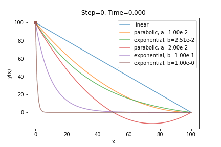

# Fastest curve

### Contributors (alphabetical order)
* Sky Huang ([github.com/skyhuang1208](https://github.com/skyhuang1208))
* Louis Yang ([github.com/louis925](https://github.com/louis925))

### Introduction
We built a physical-based simulator to calculate the time spent for a ball to roll through an inclined curve. The simulator solves classical equation of motion and simulates the ball movement in different ways (see below). This package was designed to be able to extend to more complicate scenarios; For example, it is straightforward to add frictions into the package, or to simulate the ball movement in a world where acceleration of gravity varies with time.

### Goal
The simulator was built mainly to study the "fastest-curve" problem, i.e., we use the simulator to calculate the travelling time of the ball on different curves. We can also use the simulator to track ball movement since the courses of the ball can be recorded.

### Motivation
https://www.wikipedia.org/wiki/Brachistochrone_curve

### Approaches
1. Acceleration-based simulation - 
In this approach, acceleration is directly calculated from force equations. The velocity and position of the ball is then updated accordingly.
2. Velocity-based simulation - 
In a frictionless curve, the ball follows *law of conservation of mechanical energy*. Therefore, the magnitude of velocity is directly a function of height of the ball. The position of the ball can then be updated accordingly.
3. Velocity-based integration - 
From the above apporach, we calculate the velocity of an given position. The travelling distance of the ball can be obtained by integraling over velocities at different positions. The travelling time can then be calculated. We can only obtain the total time spent but the moving process cannot be recorded.

### How to use
See [`main.ipynb`](./main.ipynb).
